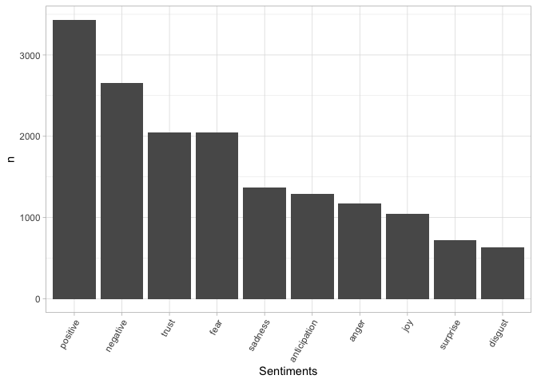

Sentiment analysis and tf\_idf
==============================

Obtaining data
--------------

Navigating to this Github repository and selecting a new text dataset to
analyze:
<a href="https://github.com/niderhoff/nlp-datasets" class="uri">https://github.com/niderhoff/nlp-datasets</a>

Processing data
---------------

1.  Importing your data into R
2.  Performing additional cleaning tasks as needed.

<!-- -->

    #Installing packages needed for text analysis.
    loadPkg = function(toLoad){
      for(lib in toLoad){
        if(! lib %in% installed.packages()[,1])
        { install.packages(lib, repos='http://cran.rstudio.com/') }
        suppressMessages( library(lib, character.only=TRUE) ) }
    }

    packs=c('tidyverse', 'tidytext', 'textdata')

    loadPkg(packs)

    #Reading the input data csv file 
    library(readr)
    disaster_res_msg_val <- read_csv("disaster_res_msg_val.csv")
    View(disaster_res_msg_val)

Getting to know the data - dimensions, column names and more information about the data
---------------------------------------------------------------------------------------

    dim(disaster_res_msg_val)

    ## [1] 2573   42

    names(disaster_res_msg_val)

    ##  [1] "id"                     "split"                  "message"               
    ##  [4] "original"               "genre"                  "related"               
    ##  [7] "PII"                    "request"                "offer"                 
    ## [10] "aid_related"            "medical_help"           "medical_products"      
    ## [13] "search_and_rescue"      "security"               "military"              
    ## [16] "child_alone"            "water"                  "food"                  
    ## [19] "shelter"                "clothing"               "money"                 
    ## [22] "missing_people"         "refugees"               "death"                 
    ## [25] "other_aid"              "infrastructure_related" "transport"             
    ## [28] "buildings"              "electricity"            "tools"                 
    ## [31] "hospitals"              "shops"                  "aid_centers"           
    ## [34] "other_infrastructure"   "weather_related"        "floods"                
    ## [37] "storm"                  "fire"                   "earthquake"            
    ## [40] "cold"                   "other_weather"          "direct_report"

    head(disaster_res_msg_val)

    ## # A tibble: 6 x 42
    ##      id split message original genre related   PII request offer aid_related
    ##   <dbl> <chr> <chr>   <chr>    <chr>   <dbl> <dbl>   <dbl> <dbl>       <dbl>
    ## 1     8 vali… Lookin… Patnm, … dire…       1     0       0     0           0
    ## 2    18 vali… I am i… Nou kwa… dire…       1     0       1     0           1
    ## 3    28 vali… are yo… Eske se… dire…       0     0       0     0           0
    ## 4    38 vali… People… MEZANMI… dire…       1     0       1     0           1
    ## 5    48 vali… How we… Comment… dire…       1     0       0     0           0
    ## 6    58 vali… Good e… Bonswa … dire…       1     0       0     0           1
    ## # … with 32 more variables: medical_help <dbl>, medical_products <dbl>,
    ## #   search_and_rescue <dbl>, security <dbl>, military <dbl>, child_alone <dbl>,
    ## #   water <dbl>, food <dbl>, shelter <dbl>, clothing <dbl>, money <dbl>,
    ## #   missing_people <dbl>, refugees <dbl>, death <dbl>, other_aid <dbl>,
    ## #   infrastructure_related <dbl>, transport <dbl>, buildings <dbl>,
    ## #   electricity <dbl>, tools <dbl>, hospitals <dbl>, shops <dbl>,
    ## #   aid_centers <dbl>, other_infrastructure <dbl>, weather_related <dbl>,
    ## #   floods <dbl>, storm <dbl>, fire <dbl>, earthquake <dbl>, cold <dbl>,
    ## #   other_weather <dbl>, direct_report <dbl>

Word count
----------

1.  Tokenizing and generating a word count.

<!-- -->

    #Text analysis with unnest_tokens for splitting text into simple objects and returns a df
    disaster_words <- disaster_res_msg_val %>% select(id, message) %>% unnest_tokens(word, message)
    head(disaster_words)

    ## # A tibble: 6 x 2
    ##      id word   
    ##   <dbl> <chr>  
    ## 1     8 looking
    ## 2     8 for    
    ## 3     8 someone
    ## 4     8 but    
    ## 5     8 no     
    ## 6     8 name

    disaster_words %>% count(word, sort = T) %>% slice(1:15) %>% 
      ggplot(aes(x = reorder(word, n, function(n) -n), y = n)) + 
      geom_bar(stat = "identity") + 
      theme_light() +
      theme(axis.text.x = element_text(angle = 60, hjust = 1)) + 
      xlab("Words")

1.  Using the `TidyText` package, removing stop words and generate a new
    word count.

<!-- -->

    head(stop_words)

    ## # A tibble: 6 x 2
    ##   word      lexicon
    ##   <chr>     <chr>  
    ## 1 a         SMART  
    ## 2 a's       SMART  
    ## 3 able      SMART  
    ## 4 about     SMART  
    ## 5 above     SMART  
    ## 6 according SMART

    #Getting rid of words from the dataframe that match the TidyText stop words
    better_disaster_words <- disaster_words %>% anti_join(stop_words)

    better_disaster_words %>% count(word, sort = T) %>% slice(1:15) %>% 
      ggplot(aes(x = reorder(word, n, function(n) -n), y = n)) + 
      geom_bar(stat = "identity") + 
      theme_light() +
      theme(axis.text.x = element_text(angle = 60, hjust = 1)) + 
      xlab("Words")

From the above graph, we can exclude words like “http”, “affected” which
I feel are just stop words.

1.  Creating a visualization of the word count distribution and
    interpreting my results.

<!-- -->

    personal_stop_words <- stop_words %>% select(-lexicon) %>% 
      bind_rows(data.frame(word = c("http", "affected","sandy")))

    better_disaster_words <- disaster_words %>% anti_join(personal_stop_words)

    better_disaster_words %>% count(word, sort = T) %>% slice(1:15) %>% 
      ggplot(aes(x = reorder(word, n, function(n) -n), y = n)) + 
      geom_bar(stat = "identity") + 
      theme_light() +
      theme(axis.text.x = element_text(angle = 60, hjust = 1)) + 
      xlab("Words")

I have removed the stop words although still I find words like “haiti”
which might have any meaning according to the content. But since it
sounds like a new word, I don’t wish to exclude it because it might have
significant meaning.

Tf-idf
------

1.  Generating a tf-idf measure of words in your dataset.

Here, the first input is the word and the second is the id and the word.

    idf_words <- disaster_res_msg_val %>% select(id, message) %>% 
      unnest_tokens(word,message) %>% count(id, word, sort = T)

    better_idf_words <- idf_words %>% anti_join(personal_stop_words)

    disaster_length <- better_idf_words %>% group_by(id) %>% summarize(total = sum(n()))

    better_idf_words <- left_join(better_idf_words, disaster_length)

    tfidf_words <- better_idf_words %>% bind_tf_idf(word, id, n)

    tfidf_words %>% arrange(desc(tf_idf)) %>% head()

    ## # A tibble: 6 x 7
    ##      id word                                          n total    tf   idf tf_idf
    ##   <dbl> <chr>                                     <int> <int> <dbl> <dbl>  <dbl>
    ## 1  1088 addreses                                      1     1     1  7.85   7.85
    ## 2  1318 dep                                           1     1     1  7.85   7.85
    ## 3  7438 pwenla                                        1     1     1  7.85   7.85
    ## 4  8328 wesantyahoo.fr.pepayisenyahoo.fr              1     1     1  7.85   7.85
    ## 5  9388 aaaaaaaaaaaaaaaaaaaaaaaaaaaaaaaaaaaaaaaa…     1     1     1  7.85   7.85
    ## 6  9848 decombres                                     1     1     1  7.85   7.85

The more frequently the words are used, the shorter the words is.

Sentiment analysis
------------------

Loading the pre-trained model containing word=emotions associations.

    sentiments <- get_sentiments("nrc")

    df_sentiments <- better_disaster_words %>% left_join(sentiments)

    df_sentiments_filtered <- df_sentiments %>% filter(!is.na(sentiment)) %>% group_by(sentiment) %>% summarize(n = n())

    df_sentiments_filtered %>% 
      ggplot(aes(x = reorder(sentiment, n, function(n) -n), y = n)) + 
      geom_bar(stat = "identity") + 
      theme_light() +
      theme(axis.text.x = element_text(angle = 60, hjust = 1)) + 
      xlab("Sentiments")

Interpretation
--------------

Write a paragraph interpreting the word count, tf-idf, and sentiment of
the words in your dataset. What do these tell us about the conversations
surrounding your hashtag (if anything)? How could you improve this
analysis?

I see that in the tf\_idf analysis, there are some words displayed which
don’t have a meaning. It refelects the inverse document frequence which
is a numerical measure to reflect how important a word is in a document
I believe it is calculated by figuring out how many times a word appears
in a document and the inverse documnet frequency if the word across a
set of documents. Sentiment analysis is often used in business to detect
sentiment in social data, gauge brand reputation, and understand
customers.It’s the process of analysing online pieces of writing to
determine the emotional tone they carry. In simple words, sentiment
analysis is used to find the author’s attitude towards something.
Sentiment analysis tools categorize pieces of writing as positive,
neutral, or negative. In my specific data set, I find that it’s positive
while there are few negative emotions, positive leads the graph.
